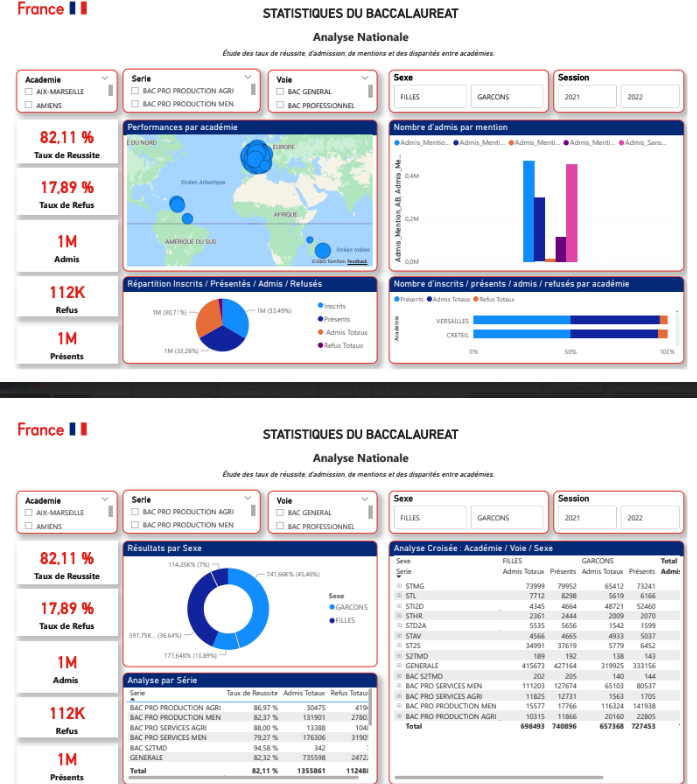

# 🎓 Analyse des résultats du Baccalauréat en France
 

## 🎯 Objectif
Étudier les taux de réussite, d’admission, de mentions et les disparités entre académies afin de mieux comprendre les écarts territoriaux.

---

## 🛠️ Travaux réalisés
- Structuration et préparation des données liées aux résultats du baccalauréat  
- Analyse exploratoire des taux de réussite et des disparités entre académies  
- Création de KPI et d’indicateurs de performance  
- Développement de visualisations et d’un dashboard Power BI interactif  
- Restitution des résultats pour faciliter l’analyse décisionnelle  

---

## 📊 Outils
- Power BI  
- Power Query  

---

## 🔗 Rapport interactif
➡️ Lien Power BI : à venir
