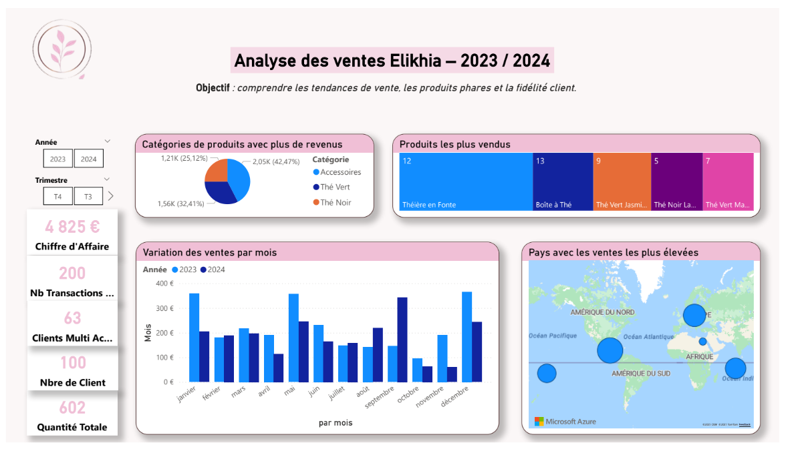

# 📈 Reporting commercial — Projet Elikhia

## 🎯 Objectif
Mettre en place un reporting décisionnel afin de suivre les performances commerciales et d’accompagner le pilotage de l’activité.

---

## 🛠️ Travaux réalisés
- Collecte, nettoyage et contrôle de la qualité des données sous Power Query  
- Modélisation décisionnelle des données et création de KPI  
- Développement de tableaux de bord Power BI pour le reporting décisionnel et le suivi des ventes  
- Gestion et maintenance des rapports dans Power BI Service  
- Restitution des analyses auprès des équipes métiers  

---

## 📊 Outils
- Power BI  
- Power Query  
- Power BI Service  

---

## 🔗 Rapport interactif
➡️ Rapport Power BI interactif disponible sur demande (présentation en entretien).
