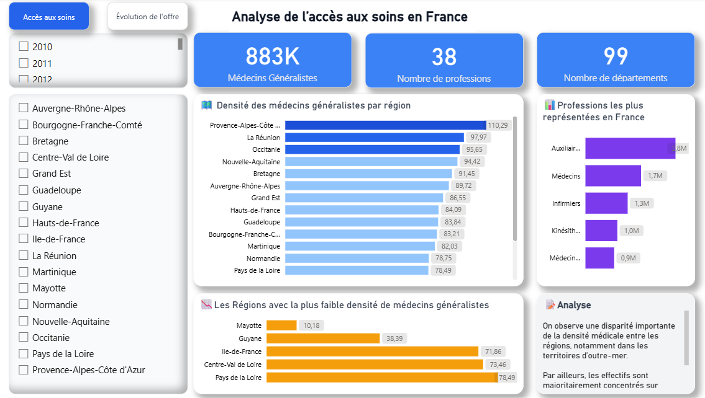
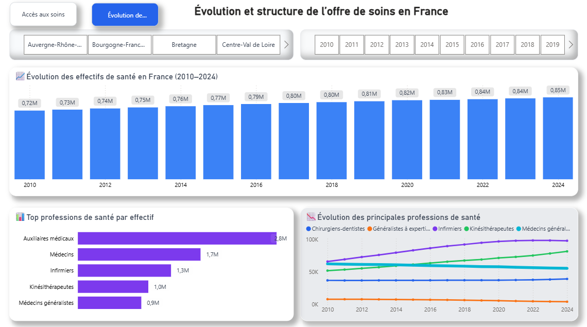

# 🏥 Analyse de l'offre médicale en France (2010–2024)

## 📌 Contexte

Ce projet Power BI a été réalisé à partir de données ouvertes de **data.gouv.fr** afin d'analyser l'évolution de l'offre médicale en France entre 2010 et 2024.

L'objectif est de fournir une vision synthétique de la répartition des professionnels de santé, de leur évolution dans le temps et des disparités territoriales à travers un tableau de bord interactif.

---

## 📷 Aperçu du tableau de bord

### Accès aux soins

### Évolution de l'offre de soins

---

## 🛠️ Technologies & Ressources utilisées

- Power BI
- Power Query
- DAX
- Data.gouv.fr

---

## 📊 Principaux indicateurs

- Nombre de médecins généralistes
- Nombre de professions de santé
- Nombre de départements couverts
- Densité médicale par région
- Évolution des effectifs (2010–2024)
- Classement des professions de santé
- Analyse des disparités territoriales

---

## 💡 Principaux enseignements

- L'offre médicale progresse globalement entre 2010 et 2024.
- D'importantes disparités territoriales persistent entre les régions.
- Les territoires d'outre-mer présentent les densités médicales les plus faibles.
- Les auxiliaires médicaux représentent la catégorie de professionnels la plus importante.
- Le tableau de bord permet une analyse dynamique grâce aux filtres par année et par région.

---

## 🔗 Rapport interactif
➡️ Rapport Power BI interactif disponible sur demande (présentation en entretien).
